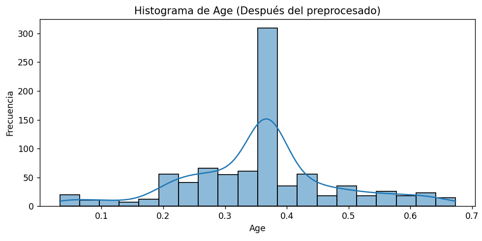
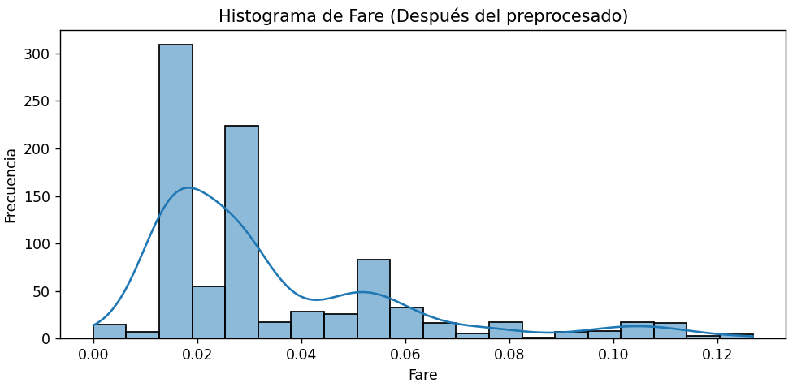
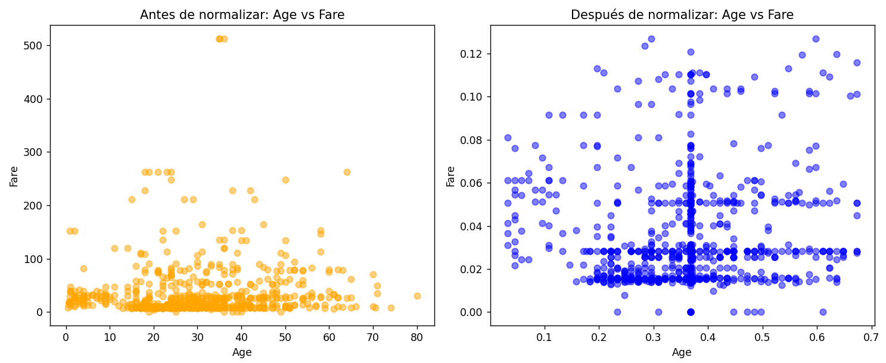
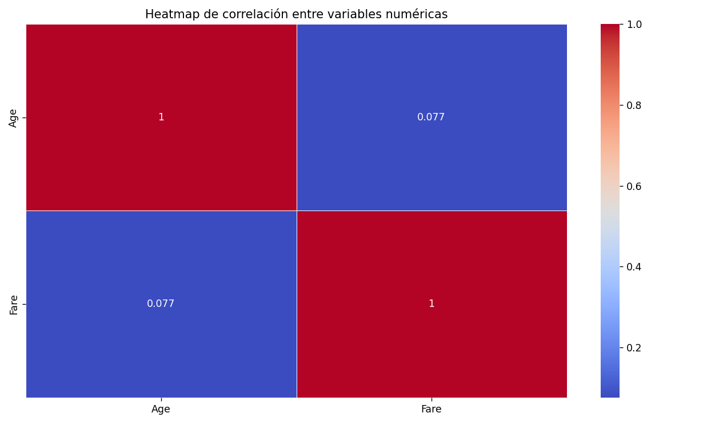

# Preprocesamiento y Visualización de Datos en Python

## Descripción del proyecto
Este proyecto es una herramienta de línea de comandos para facilitar el preprocesamiento de datos. 
Este proyecto proporciona una interfaz interactiva en consola para realizar tareas comunes de **preprocesamiento de datos** como:
- Selección de columnas
- Manejo de valores faltantes
- Transformación de variables categóricas
- Normalización de datos
- Detección de valores atípicos
- Visualización de variables
- Exportación de datos preprocesados

Está orientado a facilitar la preparación de datasets antes de aplicarlos a modelos de regresión lineal.


## Cómo ejecutar el programa

1. Clonar el repositorio desde GitHub
Abre una terminal y ejecuta el siguiente comando (reemplaza la URL con la del repositorio real si es diferente):

    `git clone https://github.com/sofiagarciap/preprocesador-datos.git`


    Esto descargará una copia local del proyecto.

2. Acceder al directorio del proyecto

    `cd preprocesador-datos`

3. Activar el entorno virtual

    `venv\Scripts\activate`

4. Instalar las dependencia necesarias

    `pip install -r requirements.txt`

5. Ejecutar el programa

    `python menu.py`

6. El sistema te guiará a través de un menú interactivo que permite:
- Cargar el dataset
- Seleccionar variables
- Aplicar preprocesado (manejo de valores faltantes, tranformación de datos categóricos, normalización y escalado de datos y manejo de valore atipicos)
- Visualizar estadísticas y gráficos
- Exportar el dataset procesado

Nota: Asegúrate de tener tu archivo de datos en formato .csv, .xlsx o .db.

## Ejemplo de uso

### 1. Cargar datos

---
    =============================
    Menú Principal
    =============================
    [-] 1. Cargar datos (pendiente)
    [✗] 2. Preprocesado de datos (requiere carga de datos)
    [✗] 3. Visualización de datos (requiere preprocesado completo)
    [✗] 4. Exportar datos (requiere preprocesado completo)
    [✓] 5. Salir
    Seleccione una opción: 1
    =============================
    Carga de Datos
    =============================
    Seleccione el tipo de archivo a cargar:
    [1] CSV
    [2] Excel
    [3] SQLite
    [4] Volver al menú principal
    Seleccione una opción: 1
    Ingrese la ruta del archivo CSV: C:\Users\sogap\OneDrive\Escritorio\IA\segundo\IS\preprocesador-datos\datafiles\titanic_survival.csv
    Datos cargados correctamente.
    Número de filas: 891
    Número de columnas: 12
    Primeras 5 filas:
    PassengerId  Survived  Pclass                                               Name     Sex   Age  SibSp  Parch            Ticket     Fare Cabin Embarked
    0            1         0       3                            Braund, Mr. Owen Harris    male  22.0      1      0         A/5 21171   7.2500   NaN        S
    1            2         1       1  Cumings, Mrs. John Bradley (Florence Briggs Th...  female  38.0      1      0          PC 17599  71.2833   C85        C
    2            3         1       3                             Heikkinen, Miss. Laina  female  26.0      0      0  STON/O2. 3101282   7.9250   NaN        S
    3            4         1       1       Futrelle, Mrs. Jacques Heath (Lily May Peel)  female  35.0      1      0            113803  53.1000  C123        S
    4            5         0       3                           Allen, Mr. William Henry    male  35.0      0      0            373450   8.0500   NaN        S
---

### 2. Seleccionar columnas
--- 
    =============================
    Menú Principal
    =============================
    [✓] 1. Cargar datos (completado)
    [-] 2. Preprocesado de datos (pendiente)
            [-] 2.1 Selección de columnas (pendiente)
            [✗] 2.2 Manejo de datos faltantes (requiere selección de columnas)
            [✗] 2.3 Transformación de datos categóricos (requiere manejo de valores faltantes)
            [✗] 2.4 Normalización y escalado (requiere transformación categórica)
            [✗] 2.5 Detección y manejo de valores atípicos (requiere normalización)
    [✗] 3. Visualización de datos (requiere preprocesado completo)
    [✗] 4. Exportar datos (requiere preprocesado completo)
    [✓] 5. Salir
    Seleccione una opción: 2.1
    =============================
    Selección de Columnas
    =============================
    Columnas disponibles en los datos:
    [1] PassengerId
    [2] Survived
    [3] Pclass
    [4] Name
    [5] Sex
    [6] Age
    [7] SibSp
    [8] Parch
    [9] Ticket
    [10] Fare
    [11] Cabin
    [12] Embarked
    Ingrese los números de las columnas de entrada (features), separados por comas: 5, 6, 10
    Ingrese el número de la columna de salida (target): 11
    Selección guardada: Features = ['Sex', 'Age', 'Fare'], Target = Cabin
---
### 3. Manejo de datos faltantes
---
    =============================
    Menú Principal
    =============================
    [✓] 1. Cargar datos (completado)
    [-] 2. Preprocesado de datos (pendiente)
            [✓] 2.1 Selección de columnas (completado)
            [-] 2.2 Manejo de datos faltantes (pendiente)
            [✗] 2.3 Transformación de datos categóricos (requiere manejo de valores faltantes)
            [✗] 2.4 Normalización y escalado (requiere transformación categórica)
            [✗] 2.5 Detección y manejo de valores atípicos (requiere normalización)
    [✗] 3. Visualización de datos (requiere preprocesado completo)
    [✗] 4. Exportar datos (requiere preprocesado completo)
    [✓] 5. Salir
    Seleccione una opción: 2.2
    =============================
    Manejo de Valores Faltantes
    =============================
    Se han detectado valores faltantes en las siguientes columnas seleccionadas:
    - Age: 177 valores faltantes
    - Cabin: 687 valores faltantes

    Seleccione una estrategia para manejar los valores faltantes:
    [1] Eliminar filas con valores faltantes
    [2] Rellenar con la media de la columna
    [3] Rellenar con la mediana de la columna
    [4] Rellenar con la moda de la columna
    [5] Rellenar con un valor constante
    [6] Volver al menú principal
    Seleccione una opción: 2
    ⚠ No se puede calcular la media para la columna 'Cabin' (no numérica).
    Valores faltantes rellenados con la media de cada columna numérica.
---
### 4. Tranformación de datos categóricos
---
    =============================
    Menú Principal
    =============================
    [✓] 1. Cargar datos (completado)
    [-] 2. Preprocesado de datos (pendiente)
            [✓] 2.1 Selección de columnas (completado)
            [✓] 2.2 Manejo de datos faltantes (completado)
            [-] 2.3 Transformación de datos categóricos (pendiente)
            [✗] 2.4 Normalización y escalado (requiere transformación categórica)
            [✗] 2.5 Detección y manejo de valores atípicos (requiere normalización)
    [✗] 3. Visualización de datos (requiere preprocesado completo)
    [✗] 4. Exportar datos (requiere preprocesado completo)
    [✓] 5. Salir
    Seleccione una opción: 2.3
    =============================
    Transformación de Datos Categóricos
    =============================
    Se han detectado columnas categóricas en las variables de entrada seleccionadas:
    - Sex

    Seleccione una estrategia de transformación:
    [1] One-Hot Encoding (genera nuevas columnas binarias)
    [2] Label Encoding (convierte categorías a números enteros)
    [3] Volver al menú principal
    Seleccione una opción: 1
    Transformación completada con One-Hot Encoding.
---
### 5. Normalización y escalado
--- 
    =============================
    Menú Principal
    =============================
    [✓] 1. Cargar datos (completado)
    [-] 2. Preprocesado de datos (pendiente)
            [✓] 2.1 Selección de columnas (completado)
            [✓] 2.2 Manejo de datos faltantes (completado)
            [✓] 2.3 Transformación de datos categóricos (completado)
            [-] 2.4 Normalización y escalado (pendiente)
            [✗] 2.5 Detección y manejo de valores atípicos (requiere normalización)
    [✗] 3. Visualización de datos (requiere preprocesado completo)
    [✗] 4. Exportar datos (requiere preprocesado completo)
    [✓] 5. Salir
    Seleccione una opción: 2.4
    =============================
    Normalización y Escalado
    =============================
    Se han detectado columnas numéricas en las variables de entrada seleccionadas:
    - Age
    - Fare

    Seleccione una estrategia de normalización:
    [1] Min-Max Scaling (escala valores entre 0 y 1)
    [2] Z-score Normalization (media 0, desviación estándar 1)
    [3] Volver al menú principal
    Seleccione una opción: 1
    Normalización completada con Min-Max Scaling.
---
### 6. detección de valores atípicos
--- 
    =============================
    Menú Principal
    =============================
    [✓] 1. Cargar datos (completado)
    [-] 2. Preprocesado de datos (pendiente)
            [✓] 2.1 Selección de columnas (completado)
            [✓] 2.2 Manejo de datos faltantes (completado)
            [✓] 2.3 Transformación de datos categóricos (completado)
            [✓] 2.4 Normalización y escalado (completado)
            [-] 2.5 Detección y manejo de valores atípicos (pendiente)
    [✗] 3. Visualización de datos (requiere preprocesado completo)
    [✗] 4. Exportar datos (requiere preprocesado completo)
    [✓] 5. Salir
    Seleccione una opción: 2.5
    =============================
    Detección y Manejo de Valores Atípicos
    =============================
    Se han detectado valores atípicos en las siguientes columnas numéricas seleccionadas:
    - Age: 66 valores atípicos detectados
    - Fare: 116 valores atípicos detectados

    Seleccione una estrategia para manejar los valores atípicos:
    [1] Eliminar filas con valores atípicos
    [2] Reemplazar valores atípicos con la mediana de la columna
    [3] Mantener valores atípicos sin cambios
    [4] Volver al menú principal
    Seleccione una opción: 2
    Valores atípicos reemplazados con la mediana de cada columna.
---
### 7. Visualización de datos
#### Resumen estadistico de las variables seleccionadas
---
    =============================
    Menú Principal
    =============================
    [✓] 1. Cargar datos (completado)
    [✓] 2. Preprocesado de datos (completado)
            [✓] 2.1 Selección de columnas (completado)
            [✓] 2.2 Manejo de datos faltantes (completado)
            [✓] 2.3 Transformación de datos categóricos (completado)
            [✓] 2.4 Normalización y escalado (completado)
            [✓] 2.5 Detección y manejo de valores atípicos (completado)
    [-] 3. Visualización de datos (pendiente)
    [✗] 4. Exportar datos (requiere preprocesado completo)
    [✓] 5. Salir
    Seleccione una opción: 3

    ==============================
    Visualización de Datos
    ==============================
    Seleccione qué tipo de visualización desea generar:
    [1] Resumen estadístico de las variables seleccionadas
    [2] Histogramas de variables numéricas
    [3] Gráficos de dispersión antes y después de la normalización
    [4] Heatmap de correlación de variables numéricas
    [5] Volver al menú principal
    Seleccione una opción: 1

    Resumen estadístico de las variables seleccionadas:
    --------------------------------------------------

    Variables numéricas:
                Age        Fare
    count  891.000000  891.000000
    mean     0.358386    0.033931
    std      0.123149    0.024814
    min      0.032420    0.000000
    25%      0.293164    0.015440
    50%      0.367921    0.028213
    75%      0.409399    0.047138
    max      0.673285    0.126872

    Distribución de variables categóricas:

    Sex_female:
    Sex_female
    0    577
    1    314
    Name: count, dtype: int64

    Sex_male:
    Sex_male
    1    577
    0    314
    Name: count, dtype: int64
---
#### Histogramas de variables numéricas


#### Gráficos de dispersión antes y después de la normalización

#### Heatmap de correlación de variables numéricas

### 8. Exportar datos
---
    =============================
    Menú Principal
    =============================
    [✓] 1. Cargar datos (completado)
    [✓] 2. Preprocesado de datos (completado)
            [✓] 2.1 Selección de columnas (completado)
            [✓] 2.2 Manejo de datos faltantes (completado)
            [✓] 2.3 Transformación de datos categóricos (completado)
            [✓] 2.4 Normalización y escalado (completado)
            [✓] 2.5 Detección y manejo de valores atípicos (completado)
    [✓] 3. Visualización de datos (completado)
    [-] 4. Exportar datos (pendiente)
    [✓] 5. Salir
    Seleccione una opción: 4
    =============================
    Exportación de Datos
    =============================
    Seleccione el formato de exportación:
    [1] CSV (.csv)
    [2] Excel (.xlsx)
    [3] Volver al menú principal
    Seleccione una opción: 1
    Ingrese el nombre del archivo de salida (sin extensión): prueba
    Datos exportados correctamente como "prueba.csv".
---
### 9. Salir
---
    =============================
    Menú Principal
    =============================
    [✓] 1. Cargar datos (completado)
    [✓] 2. Preprocesado de datos (completado)
            [✓] 2.1 Selección de columnas (completado)
            [✓] 2.2 Manejo de datos faltantes (completado)
            [✓] 2.3 Transformación de datos categóricos (completado)
            [✓] 2.4 Normalización y escalado (completado)
            [✓] 2.5 Detección y manejo de valores atípicos (completado)
    [✓] 3. Visualización de datos (completado)
    [✓] 4. Exportar datos (completado)
    [-] 5. Salir
    Seleccione una opción: 5
    =============================
    Salir de la Aplicación
    =============================
    ¿Está seguro de que desea salir?
    [1] Sí
    [2] No
    Seleccione una opción: 1

    Cerrando la aplicación...
---
## Requisitos

- Python 3.7 o superior  
- Bibliotecas utilizadas:
  - `pandas`
  - `scikit-learn`
  - `matplotlib`
  - `seaborn`
  - `openpyxl` (para exportar a Excel)

Instálalos ejecutando:

```bash
pip install -r requirements.txt

